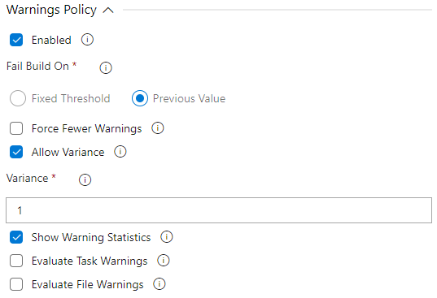

[Back to Overview](./overview.md)

# Warnings Policy
Many software projects, especially older ones, that have grown over time end up with hundreds or thousands of build warnings.
Getting rid of these warnings through refactoring or cleaning up the code can be challenging, since new warnings get lost in
the existing ones. Choosing to treat warnings as errors is often not a feasible solution as this will force teams to bring the
warnings to zero or live with ever failing builds for a long time.

The *Warnings Policy* helps you keep track of your warnings and reduce them over time. This is done by failing the build
if the number of warnings exceeds a specific value or increases between builds.

### Limitations and Special Cases
- **Warnings must be build issues**  
  The *Warnings Policy* only counts warnings that have been logged as build issues. If a task writes warning messages to
  its output but does not log them as build issues in the build system, the policy is not able to see them. 

### Parameters of the Build Warnings Policy

- **Enabled:** Use this checkbox to enable or disable the policy. If the policy is disabled, none of the following parameters is
  visible.

- **Fail Build On:** Set this option to `Fixed Threshold` to fail the build if the number of warnings exceeds a specific value.
  This is useful if you want to allow a low number of warnings but keep them from getting out of hand, or if you want to follow a
  "no warnings policy" (i.e., *Warning Threshold* = 0). To bring down the number of warnings over time, set this option to
  `Previous Value`. This will fail the build if the number of warnings has increased since the previous build.

- **Warning Threshold:** Specify the number of warnings that must not be exceeded. This parameter is only visible if *Fail Build On*
  is set to `Fixed Threshold`.

- **Force Fewer Warnings:** Check this option if you want the current build to always have fewer warnings than the previous one. This
  option is only visible if *Fail Build On* is set to `Previous Value`.

- **Task Filters:** Since the build system can run all kinds of tasks during the build process and any of these tasks can create
  warnings, the *Warnings Policy* needs to know, which tasks it should look at and which to ignore. *Task Filters* takes a list of
  regular expressions (one per line). The policy will only look at build tasks that match one of the task filters. The matching is done by
  looking at the timeline name of each task, which is displayed below the task name in the build definition. The default value
  `/^(((android|xcode|gradlew)\\s+)?build|ant|maven|cmake|gulp)/i` matches most of the standard build tasks in Team Foundation Server/Visual
  Studio Team Services.

  **Note:** Regular expressions must use the JavaScript RegExp syntax. Click [here](http://www.regular-expressions.info/javascript.html)
  for more information.
