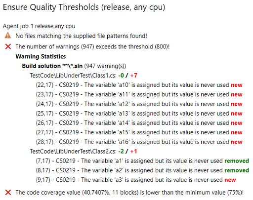
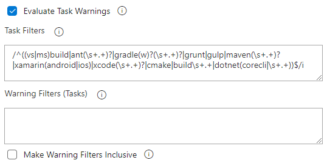
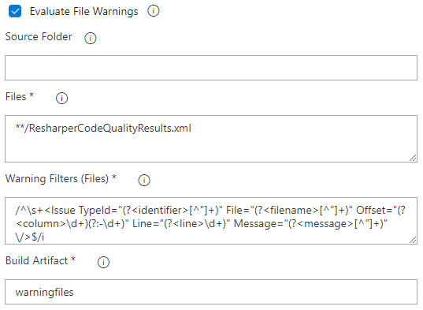

[Back to Overview](./overview.md) | [Limitations](#limitations-and-special-cases) | [Base Parameters](#base-parameters-of-the-build-warnings-policy) | [Task Warnings](#task-warnings-parameters) | [File Warnings](#file-warnings-parameters)

# Warnings Policy
Many software projects, especially older ones, that have grown over time end up with hundreds or thousands of build warnings. Getting rid of these warnings through refactoring or cleaning up the code can be challenging, since new warnings get lost in the existing ones. Choosing to treat warnings as errors is often not a feasible solution as this will force teams to bring the warnings to zero or live with ever failing builds for a long time.

The *Warnings Policy* helps you keep track of your warnings and reduce them over time. This is done by failing the build if the number of warnings exceeds a specific value or increases between builds.

### Policy result variables
The *Warnings Policy* creates the following output variables, which you can use in subsequent tasks:

- **WarningsPolicyResult (deprecated)** - Set to _passed_ when the policy passed, otherwise it's set to _failed_. This variable will be removed with a future major update. Please use the variable _WarningsPolicy.Result_ instead.
- **WarningsPolicy.Result** - Set to _passed_ when the policy passed, otherwise it's set to _failed_.
- **WarningsPolicy.Warnings.Total** - Set to the number of total warnings in the current build as seen by the _Warnings Policy_.
- **WarningsPolicy.Warnings.Filtered** - Set to the number of filtered warnings in the current build as seen by the _Warnings Policy_.

### Pull Request Status
When running in a pull request validation build, the *Warnings Policy* publishes its result as a pull request status named `warnings-policy`. The full status policy name is `bqc/warnings-policy`. To distinguish between multiple *Build Quality Checks* instances, configure the [Run Title](https://github.com/MicrosoftPremier/VstsExtensions/blob/master/BuildQualityChecks/en-US/overview.md#reporting-options) and use the policy name `bqc-{runTitle}/warnings-policy`. If you run title contains whitespace, please replace them with dashes (e.g., run title = "My Run Title" -> policy name = `bqc-my-run-title/warnings-policy`).

### Limitations and Special Cases
- **Warnings must be build issues**  
  The *Warnings Policy* only counts warnings that have been logged as build issues. If a task writes warning messages to its output but does not log them as build issues in the build system, the policy does not automatically pick those warnings up. You may use *Warning Filters (Tasks)* (see below) to add those warnings to the policy. 

### Base Parameters of the Build Warnings Policy

- <a name="enabled">**Enabled:**</a> Use this checkbox to enable or disable the policy. If the policy is disabled, none of the following parameters is visible.

  **YAML: checkWarnings** - (Optional) Default is *false*.

- <a name="failOption">**Fail Build On:**</a> Set this option to `Fixed Threshold` to fail the build if the number of warnings exceeds a specific value. This is useful if you want to allow a low number of warnings but keep them from getting out of hand, or if you want to follow a "no warnings policy" (i.e., *Warning Threshold* = 0). To bring down the number of warnings over time, set this option to `Previous Value`. This will fail the build if the number of warnings has increased since the previous build.

  **YAML: warningFailOption** - (Optional) Default is *build*. Set to *build* for the `Previous Value` option or to *fixed* for the `Fixed Threshold` option.

- <a name="threshold">**Warning Threshold:**</a> Specify the number of warnings that must not be exceeded. This parameter is only visible if *Fail Build On* is set to `Fixed Threshold`.

  **YAML: warningThreshold** - (Optional) Default is 0.

- <a name="forceFewer">**Force Fewer Warnings:**</a> Check this option if you want the current build to always have fewer warnings than the previous one. This option is only visible if *Fail Build On* is set to `Previous Value`.

  **YAML: forceFewerWarnings** - (Optional) Default is *false*.

- <a name="allowWarningVariance">**Allow Variance:**</a> Check this option to allow a temporary increase of warnings. Enabling this option will allow the policy to pass even though the number of warnings has increased. The allowed increase is configured using the *Variance* parameter. This option is only available if the parameter *Fail Build On* is set to `Previous Value` and the parameter *Force Fewer Warnings* is not enabled.

  **YAML: allowWarningVariance** - (Optional) Default is *false*.

- <a name="warningVariance">**Variance:**</a> Specify by how many the current warning count may exceed the previous value before the policy fails. Please be aware that the number of warnings may slowly but steadily increase from build to build if you allow a warning variance. Thus, you should keep this value as low as possible.

  **YAML: warningVariance** - (Required) Default is empty. Required if **allowWarningVariance** is set to *true*.

- <a name="statistics">**Show Warning Statistics:**</a> Enable this options to generate statistical information about warning changes. When enabled the policy not only shows the total number of warnings but also the changes in number of warnings grouped by task and code file or object. To keep statistics short, only files with actual changes in the number of warnings are listed. If you combine this option with *Warning Filters (Tasks)*, the filters will be applied first and only matching warnings will appear in the warning statistics.

  **YAML: showStatistics** - (Optional) Default is *false*.
  
  
  
  **Note:** Statistics only work for tasks that properly log warnings with the Azure DevOps logging command (i.e., `##vso[task.logissue ...]`) and only on Team Foundation Server 2017 or later and Azure DevOps Services. If you need support for additional tasks, please let us know and preferably send us a sample log of the corresponding build task to <a href='&#109;&#97;&#105;&#108;&#116;&#111;&#58;&#112;&#115;&#103;&#101;&#114;&#101;&#120;&#116;&#115;&#117;&#112;&#112;&#111;&#114;&#116;&#64;&#109;&#105;&#99;&#114;&#111;&#115;&#111;&#102;&#116;&#46;&#99;&#111;&#109;'>&#112;&#115;&#103;&#101;&#114;&#101;&#120;&#116;&#115;&#117;&#112;&#112;&#111;&#114;&#116;&#64;&#109;&#105;&#99;&#114;&#111;&#115;&#111;&#102;&#116;&#46;&#99;&#111;&#109;</a>.

  **Note:** Detailed statistics use a heuristic mechanism to find changed (i.e., added or removed) warnings. That algorithm cannot always be accurate and might report wrong changes. If you feel details are inaccurate, please take a look at our [FAQ](https://github.com/MicrosoftPremier/VstsExtensions/blob/master/BuildQualityChecks/en-US/FAQ.md).

### Task Warnings Parameters

- <a name="evaluateTaskWarnings">**Evaluate Task Warnings:**</a> Check this option to evaluate warnings from other pipeline tasks. In most cases you should leave this option checked. If you just want to evaluate warnings from log files (see *Evalutate File Warnings*), you need to uncheck this option. Otherwise, the task will always count all warnings from pipeline tasks in addition to warnings from log files. You need to either check this or the *Evaluate File Warnings* option.

  **YAML: evaluateTaskWarnings** - (Optional) Default is *true*.

- <a name="taskFilters">**Task Filters:**</a> Since the build system can run all kinds of tasks during the build process and any of these tasks can create warnings, the *Warnings Policy* needs to know, which tasks it should look at and which to ignore. *Task Filters* takes a list of regular expressions (one per line). The policy will only look at build tasks that match one of the task filters. The matching is done against the name (e.g., _VSBuild_) and display name (e.g, _Build solution **/*.sln_) of each task. The default value `/^((vs|ms)build|ant(\\s+.+)?|gradle(w)?(\\s+.+)?|grunt|gulp|maven(\\s+.+)?|xamarin(android|ios)|xcode(\\s+.+)?|cmake|build\\s+.+)$/i` matches most of the standard build tasks in Azure DevOps Server/Services. This setting is only visible if *Evaluate Task Warnings* is checked.

  **YAML: warningTaskFilters** - (Optional) Default is shown above. Set to one or more task filter values. Start multiple entires with a pipe sign and keep each entry on a separate indented line.

  **Note:** Regular expressions must use the [JavaScript RegExp](http://www.regular-expressions.info/javascript.html) syntax.

- <a name="warnFilters">**Warning Filters (Tasks):**</a> In some cases, you may want to analyze only specific types of warnings (e.g., unreachable code warnings, static code analysis warnings). *Warning Filters (Tasks)* allow you to do just that. Specify a list of regular expressions (one per line) that only match the types of warnings you are looking for and the policy will evaluate only those warnings. The policy result will show the total number of warnings as well as the number of filtered warnings. Keep in mind that *Warning Filters (Tasks)* analyze the log file of build tasks and does a simple text match. Thus, you need to make sure that your regular expressions match each warning only once. This setting is only visible if *Evaluate Task Warnings* is checked.

  **YAML: warningFilters** - (Optional) Default is empty. Set to one or more filter values. Start multiple entries with a pipe sign and keep each entry on a separate indented line.

  By default, filtered warnings are listed under _unknown files_ in warning statistics. However, you can use the following predefined named groups in your regular expression to provide the necessary information for the task to correctly include your filtered warnings in statistics. Use the following named groups:
  - **filename** or **object** - the name of the file or object in which the warning occurred
  - **line** - the line number on which the warning occurred
  - **column** - the column number on which the warning occurred
  - **identifier** or **category** - the warning ID or category
  - **message** - the warning message
  
  **Examples of filters for specific warning types:**
  - Unused variables (.NET): `/##\[warning\].+CS0219:/i`
  - Static code analysis (.NET): `/##\[warning\].+CA.+:/i`
  - StyleCop warnings (MSBuild and Roslyn): `/##\[warning\].+SA.+:/i`
  
  **Exmaples of filters for custom warning format with statistics information:**
  - **Log output:** ISSUE: warning in file myfile.cs on line 13, column 2: ID123 - This is not good  
    **Filter:** `/issue: warning in file (?<filename>.+?) on line (?<line>\d+), column (?<column>\d+): (?<identifier>[^ ]+) - (?<message>.+)$/i`
  - **Log output:** ANALYSIS: Performance - 'Class1' should be made static  
    **Filter:** `/analysis: (?<category>[^ ]+) - (?<message>(?:[^']+?)?(?:'(?<object>.+)'.+)?)$/i`

  *Warning Filters (Tasks)* can also be used to count warnings if a build task does not log warnings as build issues, as long as the task logs the number of warnings to its log file. To do so, specify a warning filter that contains exactly **one** unnamed capture group that matches the number of warnings. The captured number will be added to the total warning count as well was the filtered warning count.

  **Example (based on _StyleCop Runner_ task):**
  - Log output: `StyleCop found [28448] violations warnings across [82] projects`
  - Filter value: `/\[(\d+)\]\s+violations/i`

  **Note:** Regular expressions must use the [JavaScript RegExp](http://www.regular-expressions.info/javascript.html) syntax.

- <a name="inclusiveFiltering">**Make Warning Filters Inclusive:**</a> Checking this option changes the behavior of *Warning Filters (Tasks)*. When unchecked (default), the policy only counts warnings matching the regular expressions listed in the *Warning Filters (Tasks)* parameter (*exclusive filtering*; see above). In some cases, though, you might want to count warnings that are not properly logged by build tasks in addition to the regular warnings (*inclusive filtering*). This can be achieved by activating the *Make Warning Filters Inclusive* option. This setting is only visible if *Evaluate Task Warnings* is checked.

  **YAML: inclusiveFiltering** - (Optional) Default is *false*.

### File Warnings Parameters

- <a name="evaluateFileWarnings">**Evaluate File Warnings:**</a> Check this option to evaluate warnings from arbitrary log files. If you want to evaluate warnings from log files, check this option and specify *File Warning Filters*. The task will then parse the log files based on the provided regular expressions and count every match as a warning. If you check this option in addition to the *Evaluate Task Warnings* option, the task counts all warnings from log files in addition to warnings from pipeline tasks. You need to either check this or the *Evaluate Task Warnings* option. This option is only available if *Fail Build On* is set to `Fixed Threshold`.

  **YAML: evaluateFileWarnings** - (Optional) Default is *false*.

- <a name="warningFilesFolder">**Source Folder:**</a> Folder that contains the log files you want to analyze. If you leave this empty, the task looks for files in the root folder of the repo (same as if you had specified `$(Build.SourcesDirectory)`). This setting is only visible if *Evaluate File Warnings* is checked.

  **YAML: warningFilesFolder** - Default is empty.

- <a name="warningFiles">**Files:**</a> (Required) File paths to include in the evaluation. Supports multiple lines of match patterns. See [file matching patterns reference](https://docs.microsoft.com/en-us/azure/devops/pipelines/tasks/file-matching-patterns?view=azure-devops) for more information about supported patterns. This setting is only visible if *Evaluate File Warnings* is checked.

  **YAML: warningFiles** - (Required) Default is empty. Set to one or more file matching patterns. Start multiple entries with a pipe sign and keep each entry on a separate indented line. Required if **evaluateFileWarnings** is set to *true*.

- <a name="warningFileFilters">**Warning Filters (Files):**</a> (Required) Specify a list of regular expressions (one per line) that match the warnings in your log files. Make sure that your regular expressions match each warning only once, otherwise they will be counted multiple times. If you need separate regular expressions for specific log files, please use multiple instances of the *Build Quality Checks* task. You can use the same special filters as described under [Warning Filters (Tasks)](https://github.com/MicrosoftPremier/VstsExtensions/blob/master/BuildQualityChecks/en-US/WarningsPolicy.md#warnFilters) This setting is only visible if *Evaluate File Warnings* is checked.

  **YAML: warningFileFilters** - (Required) Default is empty. Set to one or more filter values. Start multiple entries with a pipe sign and keep each entry on a separate indented line. Required if **evaluateFileWarnings** is set to *true*.

  **Note:** Regular expressions must use the [JavaScript RegExp](http://www.regular-expressions.info/javascript.html) syntax.

- <a name="warningFilesArtifact">**Build Artifact:**</a> (Required) Provide the name of the build artifact containing log files from the previous build that can be used to run file warnings analysis.
  
  If you want to compare the number of current warnings against the value from the previous build (see *Fail Build On*) or you configure the task to create warning statistics (see *Show Warning Statistics*), and you enable file warnings analysis (see *Evaluate File Warnings*), the task needs files from the previous build to compare against. Those files usually don't exist on the build agent anymore. Thus, you have to publish all files you want to analyze as a build artifact and provide the artifact name in this parameter so that the task can download the files from the previous build and analyze them.

  **Note:** You need to ensure that the file patterns specified in *Files* matches both the files from the current build and the files from the previous build! In order to properly compare files, the file names must be identical (i.e., a *File1.log* from the current build will only be compared to a *File1.log* from the previous build). In order to support multiple files with the same name, files are matched based on their relative path based on the *Source Folder* or the artifact root folder respectively.

  **Note:** Due to a limitation in the task UI, this field is always marked as required in the UI even if its value is not used by the task. Just leave the default value if you don't need the artifact (i.e., if you configured a fixed warning threshold and not enabled statistics).

  **YAML: warningFilesArtifact** - (Required) Default is empty. Required if **evaluateFileWarnings** is set to *true* and **warningFailOption** is set to *build* or **showStatistics** is set to *true*.