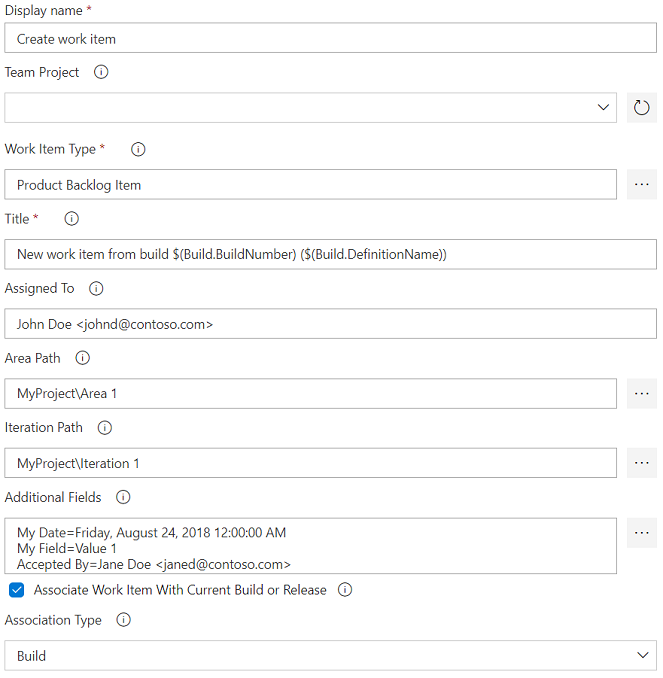
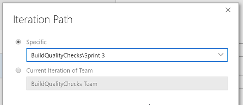
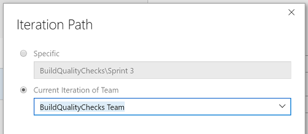
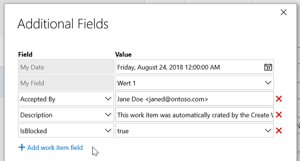
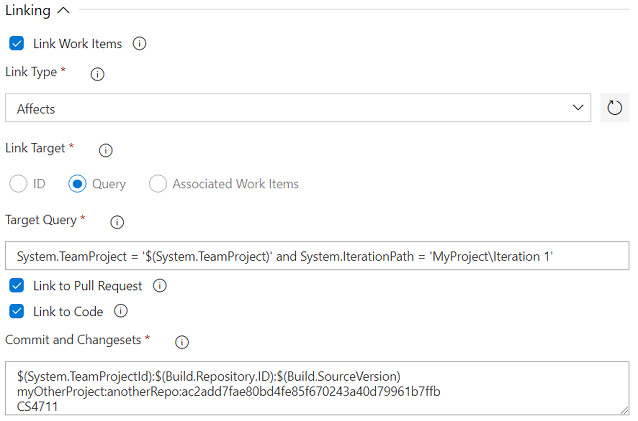
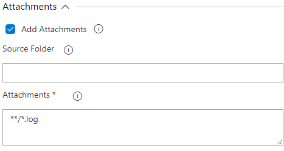

[Known Issues](#known-issues) | [Support](#support) | [YAML](#adding-the-task-to-a-yaml-definition) | [Task Parameters](#task-parameters) | [Linking](#linking) | [Attachments](#attachments) | [Duplicates](#duplicates) | [Outputs](#outputs)

# Create Work Item
The *Create Work Item* task allows you to create a work item from a build or release.

### Change Notes
You can find the changes notes for this task [here](https://github.com/MicrosoftPremier/VstsExtensions/blob/master/CreateWorkItem/en-US/changeNotes.md).

### Known Issues
- Due to manifest changes in the Visual Studio Marketplace, the regular extension cannot be installed in an offline Team Foundation Server. If you need a working vsix file for your Team Foundation Server, please download the on-prem version of this extension from [here](https://github.com/MicrosoftPremier/VstsExtensions/tree/master/CreateWorkItem/on-prem).
- Due to an issue in extension handling of Team Foundation Server and Azure DevOps Services (and a complementary mistake in our extension manifests) you might get the message "Error finding the extension" when you try to open one of the custom task editors using the "three dots" buttons. If you run into this issue, please contact us via email so we can work with you to fix the problem.

### Support
If you need help with the extension, run into issues, or have feedback or ideas for new features, please contact us at <a href='&#109;&#97;&#105;&#108;&#116;&#111;&#58;&#112;&#115;&#103;&#101;&#114;&#101;&#120;&#116;&#115;&#117;&#112;&#112;&#111;&#114;&#116;&#64;&#109;&#105;&#99;&#114;&#111;&#115;&#111;&#102;&#116;&#46;&#99;&#111;&#109;'>&#112;&#115;&#103;&#101;&#114;&#101;&#120;&#116;&#115;&#117;&#112;&#112;&#111;&#114;&#116;&#64;&#109;&#105;&#99;&#114;&#111;&#115;&#111;&#102;&#116;&#46;&#99;&#111;&#109;</a> or create an issue [here](https://github.com/MicrosoftPremier/VstsExtensions/issues).

### Adding the Task to a YAML Definition
To add the *Create Work Item* task to a YAML build or release definition, use the task name and major version like this `- task: CreateWorkItem@1` and set a display name using the `displayName` property. Then add all task inputs as described under [Task Parameters](#task-parameters).

YAML snippet:

``` yaml
# Create or update a work item
- task: CreateWorkItem@1
  displayName: 'Create work item'
  inputs:
    #teamProject: # Optional
    workItemType: 
    title: 
    #assignedTo: # Optional
    #areaPath: # Optional
    #iterationPath: # Optional
    #fieldMappings: # Optional; Required if your process defines additional required work item fields
    #associate: false # Optional
    # ===== Linking Inputs =====
    #linkWorkItems: false # Optional
    #linkType: # Required if linkWorkItems = true
    #linkTarget: id # Optional; Valid values: id, wiql
    #targetId: # Required if linkWorkItems = true and linkTarget = id
    #targetWiql: # Required if linkWorkItems = true and linkTarget = wiql
    #linkPR: false # Optional
    # ===== Attachments Inputs =====
    #addAttachments: false # Optional
    #attachmentsFolder: # Optional
    #attachments: # Required if addAttachments = true
    # ===== Duplicate Inputs =====
    #preventDuplicates: false # Optional
    #keyFields: # Required if preventDuplicates = true
    #updateDuplicates: false # Optional
    #updateRules: # Optional
    # ===== Outputs Inputs =====
    #createOutputs: false # Optional
    #outputVariables: # Required if createOutputs = true
```

### Task Parameters
The task supports the default parameters listed below. All parameters support variables *including nested variables*.

**Security Note:** For security reasons we mask all secrets automatically. This ensures that you cannot exploit the *Create Work Item* task to gain access to secret values stored in Azure DevOps.



- <a name="teamProject">**Team Project:**</a> Select the team project in which to create the new work item or leave empty to use the current project. If the list is empty, click the refresh button on the right.

  **YAML: teamProject** - (Optional) Default is empty.

- <a name="workItemType">**Work Item Type:**</a> Specify the work item type you want to create. If you know the exact name of the work item type, simply type it into the textbox. You may also click on the selection icon on the right (three dots) and select a work item type from the drop-down list displayed in the opening dialog. This field is required.

  

  **YAML: workItemType** - (Required) Default is empty.

  **Note:** The dialog only shows work item types that you can create using the regular Azure DevOps UI. While technically possible, we do not recommend creating hidden work item types like code review work items.

- <a name="title">**Title:**</a> Enter the title for the new work item. This field is required.
  
  **YAML: title** - (Required) Default is empty.

- <a name="assignedTo">**Assigned To:**</a> Enter an optional identity to assign the new work item to. Since there currently is no way to use the regular identity picker control in build tasks or extensions, you have to manually enter the value in the correct format. Please make sure to use the format **Display Name &lt;Login Email Address&gt;** (e.g., *John Doe &lt;johnd@contoso.com&gt;*). If you use an incorrect format, the task will fail to create the work item.
  
  **YAML: assignedTo** - (Optional) Default is empty.

- <a name="areaPath">**Area Path:**</a> Enter an optional area path for the new work item. If you omit this value, the work item will automatically be created in the default area path (i.e., the root area unless you created a special work item rule). Click the selection icon on the right (three dots) to select one of the existing areas.

  

  **YAML: areaPath** - (Optional) Default is empty. Use a backslash as the delimiter of area hierarchies (e.g., *'MyProject\Area1\Subarea1'*).

- <a name="iterationPath">**Iteration Path:**</a> Enter an optional iteration path for the new work item. If you omit this value, the work item will automatically be created in the default iteration path (i.e., the root iteration unless you created a special work item rule). By clicking the selection icon on the right (three dots) you can open a special iteration path picker that lets you choose between a specific iteration path (fixed value for all new work item) or a team name. If you select the team option, the new work item will always be created in the team's current iteration. In case there is no current iteration (e.g., no iterations have been associated with the team) the task falls back to the team's default iteration or the team's backlog iteration in that order depending on what value is available.

   

  **YAML: iterationPath** - (Optional) Default is empty. Use a backslash as the delimiter of iteration hierarchies (e.g., *'MyProject\Release1\Sprint1'*). If you want to assign the current area of a specific team, use the special value &lt;team ID&gt;@currentIteration. To find the team ID, go to the team settings view and copy the value from the URL.

  **Note:** When you select a team's current iteration, the iteration path parameter has the special value *Team ID;@currentIteration*. Do not change this value manually or the work item creation might fail.

- <a name="fieldMappings">**Additional Fields:**</a> If you want to set additional field values, specify them here. Each line in the text box should contain a field-value-mapping in the form of **Field Name=Field Value** (e.g., *Description=This is a test*). Please make sure to set valid values for all required fields in the selected work item type. If you use incorrect field values or field names, the task will fail to create the work item. Like the rest of the task inputs, the field mappings support variables and nested variables.

  We strongly recommend using the special editor for this field by clicking the selection button on the right (three dots). The editor ensures that you set values for all required fields, displays allowed values or special picker controls when necessary, and validates your inputs. Keep in mind, though, that there is no validation of inputs if you use variables instead of fixed values.

  

  **YAML: fieldMappings** - (Optional) Default is empty. Start multiple entries with a pipe sign and keep each entry on a separate indented line. If the selected work item type has required fields other than title, make sure to include all of them in this list.

- <a name="associate">**Associate Work Item With Current Build:**</a> Check this option if you want to associate the newly created work item with the current build. This option only takes effect when the task is running as part of a build; it is ignored when running inside a release.
  
  **YAML: associate** - (Optional) Default is *false*.

#### Linking
Use the parameters in the *Linking* group to control links from the newly created work item to already existing work items:



- <a name="linkWorkItems">**Link Work Items:**</a> Check this option to enable linking the new work item with one of more existing work items.
  
  **YAML: linkWorkItems** - (Optional) Default is *false*.

- <a name="linkType">**Link Type:**</a> Select the link type that should be used for linking other work items. If the drop-down list is empty, click the refresh button on the right. This option is only visible if linking is enabled.
  
  **YAML: linkType** - (Required) Default is empty. Set to the fully qualified link type name to use for linking (e.g., *System.LinkTypes.Hierarchy-Forward* for a *Child* link). Required if **linkWorkItems** is set to *true*.

  **Note:** The link type you select is used for the linked work item, not the created work item. Thus, if you select *Parent*, the linked work item will become the parent of the newly created work item. Please ensure that the combination of *Link Type* and *Link Target* results in a valid link relationship. E.g., if you select *Parent* as the link type and then use a *Target Query* that results in two or more work items, the task will fail to create the work item links since a work item can only have one parent.

- <a name="linkTarget">**Link Target:**</a> Choose `ID` and specify the *Target ID* to link the new work item to a specific work item with a known ID. Select `Query` and enter a valid *Target Query* to link the new work item to one ore more items matching a given work item query. Use the option `Associated Work Items` to link all work items that are associated with the current build or release to the new work item. This option is only visible if linking is enabled.
  
  **YAML: linkTarget** - (Optional) Default is *id*. Set to *id* if you want to link to a specific work item using its ID, *wiql* if you want to link to work items matching a WIQL query, or *associate* if you want to link to all work items that are associated to the current build/release.

- <a name="targetId">**Target ID:**</a> Enter the ID of the work item that should be linked to the new work item. This option is only visible if linking is enabled and *Link Target* is set to `ID`.
  
  **YAML: targetId** - (Required) Default is empty. Required if **linkTarget** is set to *id*.

- <a name="targetWiql">**Target Query:**</a> Enter a valid work item query ([WIQL syntax](https://docs.microsoft.com/en-us/vsts/boards/queries/wiql-syntax?view=vsts)) to select the linked work items. You may enter a full query or just the *WHERE* clause of the query as shown in the screenshot. The task will only use the *WHERE* clause and ignore any *SELECT*, *ORDER BY*, or *ASOF* clauses. This option is only visible if linking is enabled and *Link Target* is set to `Query`.
  
  **YAML: targetWiql** - (Required) Default is empty. Required if **linkTarget** is set to *wiql*.

- <a name="linkPR">**Link Pull Request:**</a> Check this option to enable linking the WorkItem with the Pull Request. This option will be ignored if it is not a Pull Request validation.
  
  **YAML: linkPR** - (Optional) Default is *false*.

#### Attachments
Use the parameters in the *Attachments* group to attach files to the new or updated work item.



- <a name="addAttachments">**Add Attachments:**</a> Check this option to to attach files to the new or updated work item. This may be useful if you, e.g.,  want to add build logs or other build artifacts to the work item for easier access.
  
  **YAML: addAttachments** - (Optional) Default is *false*.

- <a name="attachmentsFolder">**Source Folder:**</a> Root folder in which to search for attachments. If you leave this empty, the task looks for files in the default working directory (same as if you had specified `$(System.DefaultWorkingDirectory)`). This setting is only visible if the *Add Attachments* option is checked.

  **Security Note:** Please be careful not to attach any files that may contain sensitive data (e.g., memory dumps). If you really need those files, please ensure that you restrict access to the work item using area permissions in Azure DevOps.
  
  **YAML: attachmentsFolder** - (Optional) Default is empty.

- <a name="attachments">**Source Folder:**</a> Files to attach to the work item. Supports multiple lines of match patterns. See [file matching patterns reference](https://docs.microsoft.com/en-us/azure/devops/pipelines/tasks/file-matching-patterns?view=azure-devops) for more information about supported patterns. This setting is visible and required if the *Add Attachments* option is checked.
  
  **YAML: attachments** - (Required) Default is empty. Set to one or more file matching patterns. Start multiple entries with a pipe sign and keep each entry on a separate indented line. Required if **addAttachments** is set to *true*

#### Duplicates
Use the parameters in the *Duplicates* group to control handling of duplicates that might be created by the task:


- <a name="preventDuplicates">**Prevent Duplicates:**</a> Check this option to prevent the task from creating duplicate work items. This may be useful if you, e.g.,  want to create a work item for the first failing build but not for subsequent failing builds. Make sure to specify *Key Fields* as well.
  
  **YAML: preventDuplicates** - (Optional) Default is *false*.

- <a name="keyFields">**Key Fields:**</a> List the fields (one per line) that should be used by the task to check whether the new work item would be a duplicate or not. You may use either the field names, field reference names, or a combination of both. To check for duplicates, the task constructs a work item query based on the key fields listed here and the values of those fields in the new work item. If the query returns one or more work items, they are considered duplicates of the new work item and the task does not create a new work item. This option is only visible if duplicate prevention is enabled.
  
  **YAML: keyFields** - (Required) Default is empty. Start multiple entries with a pipe sign and keep each entry on a separate indented line. Required if **preventDuplicates** is set to *true*.

  **Example:** You configure the task to create a *Product Backlog Item* with title set to "Some Title" and area path set to "MyProject\Area1", and you configure the key fields *Title*, *Area Path*, and *State*. The task would then create the following query:

  `SELECT System.Id FROM WorkItems WHERE System.Title = 'Some Title' AND System.AreaPath = 'MyProject\Area1' AND System.State = 'New'`

  System.State is checked for the value *New* because that is the initial value that would be used by the new work item.

  **Note:** Since long-text fields (e.g., *Description*, *Steps to Reproduce*, *History*) do not support the equals comparison operator, the task will use the *CONTAINS* operator instead. Thus, a key field definition of *Description=Hello, World* will find all work items with a description containing the phrase "Hello, world".

- <a name="updateDuplicates">**Update Duplicate:**</a> Check this option to update a possible duplicate work item. If multiple duplicate work items are found, the task only updates the one that was last created (i.e., the item with the highest ID). To update work item fields specify one ore more *Update Rules*. The option ensures that work item links, build associations and pull request links are updates even if no *Update Rules* are specified. This option is only visible if duplicate prevention is enabled.

  **YAML: updateDuplicates** - (Optional) Default is *false*.

- <a name="updateRules">**Update Rules:**</a> Enter one ore more work item field update rules (one per line) to specify how the duplicate work item needs to be updated. Each rule has the format *&lt;Work Item Field (Reference) Name&gt;&lt;Update Operator&gt;&lt;Value&gt;*. You can use the field name or field reference name to specify the work item field. Within the value, you can reference pipeline variables in the regular format *$(Variable Name)* and work item field values in the format *${Work Item Field (Reference) Name}*. Possible update operators are:

  - Equals (**=**)  
    The equals operator simply overwrites the value of the specified work item field with the specified value. The rule *State=Done* would simply set the work item state to *Done*.
  - Plus-equals (**+=**)  
    The plus-equals operator only works for numeric fields and arithemtically adds the value to the current work item field value. The rule *BuildCount+=1* would increase the value in the field *BuildCount* by one.
  - Pipe-equals (**|=**)  
    The pipe-equals operator only works for text fields and concatenates the current work item field value with the new value. This is useful for multi-value fields like tags. The rule *Tags|=; Build $(Build.BuildNumber)* would add a new tag with the build number information. This is a convenient short form for using work item field references like this: *Tags=${System.Tags}; Build $(Build.BuildNumber)*

  **Note:** Field updates are applied in the order they in which they appear. Thus, if you need the original value of a work item field, make sure to reference it before updating it. Example: Use *System.History=Original title: ${System.Title}* first to store the original work item title in a comment before using *System.Title=New Title* to update the title.

  **YAML: updateRules** - (Required) Default is empty. Start multiple entries with a pipe sign and keep each entry on a separate indented line. Required if **updateDuplicates** is set to *true*.

#### Outputs
Use the parameter in the *Output Variables* group to control the creation of output variables that can be used by subsequent tasks:


- <a name="createOutputs">**Create Output Variables:**</a> Check this option to enable the creation of output variables. Variables are based on field values of the newly created work item and can be used in subsequent tasks within the same build/release phase. If duplicate handling is active and duplicates are found, the output variables are created based on the duplicate work item with the highest ID (i.e., the one that has been created last).
  
  **YAML: createOutputs** - (Optional) Default is *false*.

- <a name="outputVariables">**Output Variables:**</a> To allow maximum flexibility the task does not simply create a predefined set of output variables. Instead you can specify variable-value-mappings (one per line) in the form of **Variable Name=Work Item Value** (e.g., *NewDescription=Description*). This allows you to create just the variables you need for the values you need. You may use either the friendly field name (e.g., *Description*) or the reference name (e.g., *System.Description*) as the work item value. The following values can be used to reference special information of the work item:

  - **CWI.WorkItemUrl** - returns the URL that can be used to access the work item data as JSON (api URL)
  - **CWI.WorkItemEditUrl** - returns the URL that can be used to view and the work item in the browser

  You can reference the output variables like any other variable. If you used the mapping *NewDescription=Description*, you would reference your variable as *$(NewDescription)*.

  **YAML: outputVariables** - (Required) Default is empty. Start multiple entries with a pipe sign and keep each entry on a separate indented line. Required if **createOutputs** is set to *true*.

  **Note:** Make sure to name your output variables carefully when using multiple instances of the *Create Work Item* task in your build or release. If you use the same output variable in multiple tasks, each task overwrites the values from the previous task.

Icons made by [Pavel Kozlov](https://www.flaticon.com/authors/pavel-kozlov) from https://www.flaticon.com is licensed by [CC 3.0 BY](http://creativecommons.org/licenses/by/3.0/)